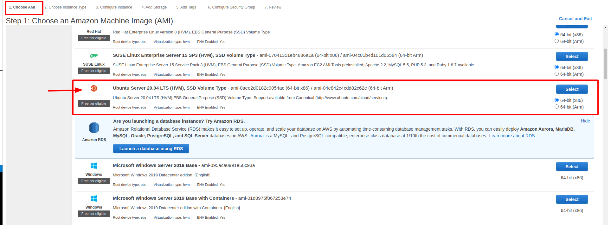
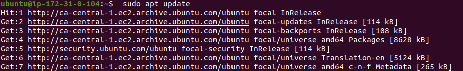
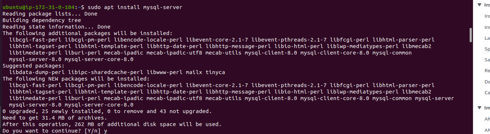

# Webstack-Implementation 

## Webstack Implementation in AWS

### Introduction

A webstack is a software framework used for web development. It is a compilation of software set used for the implementation of web application and websites. The "word" stack refers to the building of individual system's component upon one another. To  construct a webstack, the basic requirements includes having an operating system, a webserver (to host the applications), a database application, and a script interpreter or programming language. The operating system acts as the central interface between the hardware and software components. The web server helps in delivering the requested information to the clients who have inquired them. Databases help in permanently storing volumes of data. The programming language or the script interpreter operates on the client side and helps realize dynamic web applications of websites. The collection of IT components and server hardware assists in transferring essential information to the  requesting clients.

The different types of available stacks are 

MEAN Stack: MongoDB, Express, AngularJS and Node.js.

MERN Stack: MongoDB, Express, ReactJS and Node.js

Django Stack: Django, python and MySQL as Database.

Rails or Ruby on Rails: Uses Ruby, PHP and MySQL.

LAMP Stack: Linux, Apache, MySQL and PHP.

LAMP is comprised of  four components required to establish a functional web development environment. The first letters of the components' names make up the LAMP acronym and they are :

Linux is an operating system used to run the rest of the components.

Apache HTTP Server is a web server software used to serve static web pages.

MySQL is a relational database management system used for creating and managing web databases. It is also used for data warehousing, application logging, e-commerce, etc.

PHP, Python or Perl are programming languages are used to create web applications.

Each of the above components constitue  an essential layer of the stack. Collectively, these components are used to build a database-driven, dynamic websites.

LAMP is composed of Linux, Apache, MySQL, and PHP.
## L for Linux, the operating system.
## A for Apache, the web server.
## M for MySQL, the database server.
## P for PHP, the programming language.

# Project Objective

The objective of this project is to implement a webstack using AWS. AWS is the biggest cloud service provider and it offers a free tier account that will be leveraged in this project. 

## Project Prerequsites

To complete this project, an AWS account and virtual server with Ubuntu Server OS is required. The first step is the creation of an AWS account

 ## Create an AWS Account

Below is the link to create an AWS account 

https://aws.amazon.com/account/sign-up . For video tutorial on how to create an AWS account this link can be used

https://www.youtube.com/watch?v=v3WLJ_0hnOU

 Once the AWS account is created users can sign in as either root or IAM user. Typically, it is advised that users create an Iam user account and not use the root account for day to day activities. After logging in, an Ubuntu server can provisioned.
Before provising an Ubuntu OS server, a preferred region (region closest to the user) should be selected and a new EC2 instance of t2.micro family with Ubuntu Server 20.04 LTS (HVM) will be launched. 
   
   The below shows how the EC2 instance is launched in AWS

First select region closest to you

Type EC2 into the search bar and select EC2

Then click launch EC2 instance

Thereafter choose an Amazon Machine 
Image

Choose Instance Type

Configure Instance

Add Storage

Add Tags

Configure the Security Group

The last step is to review all that were selected and click launch.

.

Before a  virtual server is lauched, a key pair must be generated and downloaded. A key pair consists of a public key that AWS stores, and a private key file that users store. Together, they allow users to connect to their instance securely. For Windows AMIs, the private key file is required to obtain the password used to log into the instance. For Linux AMIs, the private key file allows users to securely SSH into their instance. Amazon EC2 supports ED25519 and RSA key pair types.(Amazon, 2022).

*The key is very important- Please save the downloaded  private key (.pem file) securely and do not share it with anyone! Connection to the server will never be possible again if it is lost!

To connect to the EC2 Instance via terminal

The following steps can be carried out

1. Type cd Downloads into the terminal (This command allows a change of directory to where the downloaded PEM file is saved)

Command : cd~/Downloads

2. Type 
$ sudo chmod 0400 < downloaded private-key-name>.pem ( This command changes the permissions for the private key(.pem) file)

Note: if this permisions are not changed an error called "Bad permissions" will be generated.

Please Note: 

The anchor tags < > means the content in the anchor needs to be replaced by user. For example, using the above command, a user needs to replace the private key to the name it was saved with on their system  during the  earlier download. If the downloaded private key  was saved/ named as Privatekey1.pem that means the above command will now be 

sudo chmod 0400 Privatekey1.pem

 3. Type 
 

Yes! A Linux Server in the Cloud has been created!

The next step is to configure the EC2 instance to a websever

To configure EC2 instance to a webserver, Apache is installed and firewall is updated.

# Apache Installation

Apache is the most widely used web server software. It was developed and maintained by Apache Software Foundation. Apache is an open source software available for free and it runs on 67% of all webservers in the world. It is fast, reliable, and secure. It can be highly customized to meet the needs of many different environments by using extensions and modules (WordPress, 2022).

Apache can be installed using the Ubuntu's package manager ‘apt’

Step 1

update the list of packages in package manager using the code below

 sudo apt update

Step 2

 run apache2 package installation

 sudo apt install apache2 

To verify that apache2 is running as a Service in the OS, the below command was used

`sudo systemctl status apache2`

 

A green dot shows that the server is running and the webserver was correctly launched in the cloud.

 

## Updating Firewall

Before the web server can recieve any web traffic, the TCP port 80 (the default port that web browsers used to access web pages on the Internet) needs to be opened. 

Please note that TCP port 22 was opened by default on EC2 machine for access via SSH. Therefore a new rule needs to be added to EC2 configuration to open inbound connection through port 80.

To Open inbound port 80

The server is running and can be accessed locally from the Internet (Source 0.0.0.0/0 means ‘from any IP address’). The below command is used to check how it can be accessed locally in the Ubuntu shell.

$ curl http://localhost:80
or
$ curl http://127.0.0.1:80`

The above command typically produces same result, however, the first command accesses the server through the DNS name while  the second command accessing the sever using an IP address (in this case IP address 127.0.0.1 corresponds to DNS name ‘localhost’ and the process of converting a DNS name to IP address is called “resolution”). 

 ## Verification
 After the port 80 is opened, the next step is to verify if the the Apache HTTP server can recieve and respond to request from the internet.
 A IP address below was used for the verification
http://35.183.48.92:80.

The image below shows that the webserver is installed and  accessible through the fire wall

## Installing MySQL

MySQL is a relational database management system based on SQL – Structured Query Language. The application is used for a wide range of purposes, including data warehousing, e-commerce, and logging applications. The most common use for mySQL however, is for the purpose of a web database. MySQL Database Service is a fully managed database service to deploy cloud-native applications and it is used within the PHP environment. Now that a webserve is running,a database management system is required for storing and managing data.

To install MySQL the following codes was used

sudo apt install mysql-server ('apt' was used to get and install mysql)

When prompted, confirm installation by typing Y, and then ENTER

When installation is completed, it’s recommended that a security script that comes pre-installed with MySQL is run. This script removes insecure default settings and lock down access to the database system. To complete this step, the code below was typed into the terminal.

$ sudo mysql_secure_installation

To test if the database was installed properly,the below command was used to test if MySQL consol can be logged into 

$ sudo mysql

The below output was generated 

To exit the MySQL console, the below command was type:

`mysql> exit`

 

 ## Installing PHP

PHP is a popular general-purpose scripting language that is especially suited to web development.It is Fast, flexible and pragmatic, PHP powers everything from blogs to the most popular websites in the world. PHP is the component of the setup that will process code to display dynamic content to the end user. In addition to the php package, php-mysql, a PHP module that allows PHP to communicate with MySQL-based databases will be required. Also, libapache2-mod-php is needed to enable Apache to handle PHP files. Core PHP packages will automatically be installed as dependencies

To install PHP these 3 packages will be run at once

$ sudo apt install php libapache2-mod-php php-mysql

 
Once the installation is completed, the version was checked for confirmation

php -v 

 

## Excellent! 
## The LAMP stack is completely installed and fully operational.

To test the  setup with a PHP script, it’s best to set up a proper Apache Virtual Host to hold the website’s files and folders. Virtual host permits the hosting of multiple websites on a single machine.

Creating a Virtual Host for the Website using Apache

A domain name called "webstacklamp" was set up and since Apache on Ubuntu 20.04 has one server block enabled by default that is configured to serve documents from the /var/www/html directory. This configuration was left as is and the authors directory was added to the default one.

The directory for Apache’s `sites-available` directory using was created using the command 

`$ sudo mkdir /var/www/webstacklamp`

Ownership was assigned to directory with `$USER` environment variable, which will reference your current system user with the command:

`$ sudo chown -R $USER:$USER /var/www/webstacklamp`

A new configuration file was created and opened in Apache’s `sites-available` directory using 'vi'

`$ sudo vi /etc/apache2/sites-available/webstacklanp.conf`

Also, a new blank file was generated and the following bare-bones configuration was inserted by hitting on `i` on the keyboard to enter the insert mode

`<VirtualHost *:80>
    ServerName webstacklamp
    ServerAlias www.webstacklamp 
    ServerAdmin webmaster@localhost
    DocumentRoot /var/www/webstacklamp
    ErrorLog ${APACHE_LOG_DIR}/error.log
    CustomLog ${APACHE_LOG_DIR}/access.log combined

 and the below was shown

000-default.conf  default-ssl.conf  projectlamp.conf`

With the VirtualHost configuration, Apache is sent a message to serve 'webstacklamp' using /var/www/projectlampl as its web root directory.  

a2ensite command below was used to enable the new virtual host:

`$ sudo a2ensite projectlamp`

To disable the default website that comes installed with Apache. This is required if custom domain name is not used. To disable Apache’s default website 2dissite command below was used

`$ sudo a2dissite 000-default`

To make sure the configuration file doesn’t contain syntax errors, the below command was run:

`$ sudo apache2ctl configtest`

Finally, Apache was reloaded so the changes was effected. The below code was used

`$ sudo systemctl reload apache2`

Excellent, the new website is active! However, the web root /var/www/webstacklamp is still empty. An index.html file  was created in that location so that testing can be performed to see that the virtual host works as expected. The command used is 
 

## Enable PHP on the website

With the default DirectoryIndex settings on Apache, a file named index.html will always take precedence over an index.php file. This is useful for setting up maintenance pages in PHP applications, by creating a temporary index.html file containing an informative message to visitors. Because this page will take precedence over the index.php page, it will then become the landing page for the application. Once maintenance is over, the index.html is renamed or removed from the document root, bringing back the regular application page.

Should a user want to change this behavior,the user will need to edit the /etc/apache2/mods-enabled/dir.conf file and change the order in which the index.php file is listed within the DirectoryIndex directive. The below code can be used

sudo vim /etc/apache2/mods-enabled/dir.conf

<IfModule mod_dir.c>
        #Change this:
        #DirectoryIndex index.html index.cgi index.pl index.php index.xhtml index.htm
        #To this:
        DirectoryIndex index.php index.html index.cgi index.pl index.xhtml index.htm
</IfModule>

Finally, PHP script will be created to test that the PHP was correctly installed and configured on the server.

Now that a custom location to host the  website’s files and folders is available, a PHP test script was created to confirm that Apache is able to handle and process requests for PHP files.

Create a new file named index.php inside the custom web root folder:

$ vim /var/www/projectlamp/index.php

This opened a blank file and the following text, which is valid PHP code was added into the file:

?php
phpinfo();

When finished, the author saved, close the file, refresh the page and a page similar to this was generate 

N.B : For privacy, the some contents in the page were covered

Credit: This guide was inspired by skill embassy(2022)

